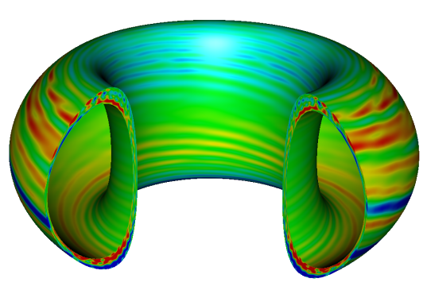

# GEM

## Compiling

### **Locally**

Compiling on a local machine with the GNU compilers requires installing LAPACK and OpenMPI as well as setting the following environment variables by exporting them (in ~/.bashrc for instance):

* LAPACK_LIB_DIR
* OMP_LIB_DIR
* OMP_INC_DIR

On systems with the apt package manager these can be installed using  
`sudo apt-get install libblas-dev liblapack-dev libopenmpi-dev`

You can locate the directories using  
`locate openmpi` or `locate lapack`

Then set the correct environment variables in ~/.bashrc with  
`export LAPACK_LIB_DIR="/path/to/LAPACK/lib/dir"`

You will have to reopen any programs such as shells or Visual Studio Code to reload environment variables. Although for your bash shell you can also just type  
`source ~/.bashrc`

### **Cori**

Compiling on NERSC/Cori requires loading the correct modules for the following compilers: 

* Cray:  `module load PrgEnv-cray`
* Intel: `module load PrgEnv-intel impi`
* GNU:   `module load PrgEnv-gnu openmpi`

**Note:** Use `module swap PrgEnv-intel PrgEnvl-cray` if you need to swap rather than load. This also works with `module swap impi openmpi` for instance.

## Debugging

Create a debug build by calling `make debug`. This will call the makefile with the flag `DEBUG=1`.
